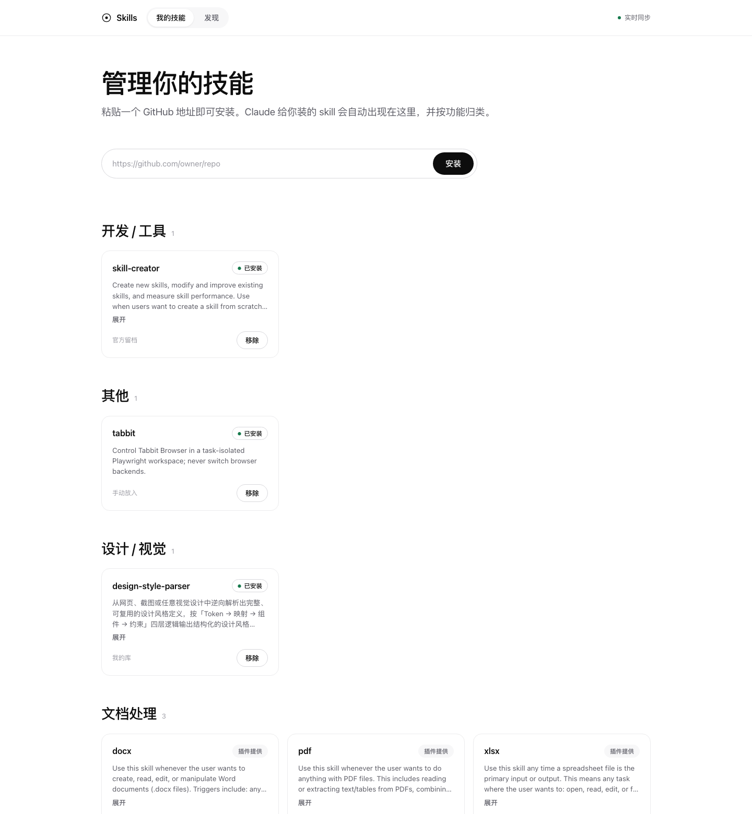

<h1 align="center">Skill Manager</h1>

<p align="center">
  一个本地网页面板，把你所有的 Claude Code skill 收进一处 ——<br>
  粘一个 GitHub 地址就装上，软链接托管，改完立刻生效。
</p>

<p align="center">
  <a href="README.md">English</a>
</p>

<p align="center">
  
  
  
  
</p>

<p align="center">
  
</p>

Claude Code 从 `~/.claude/skills` 读 skill。三五个的时候没问题，过了十几个，你就说不清装了什么、从哪来的、哪份才是真的。装一个新的意味着 clone 仓库、翻出 `SKILL.md`、再把目录挪到恰好正确的位置。

Skill Manager 把这些收进一页。能看到的 skill 全在，按功能分好组，状态写在卡片上。装一个是粘贴加点击。全程零拷贝：文件实体留在你自己的 git 仓库里，`~/.claude/skills` 里只有指向它的软链接。

> **需要 Node 18 以上**，以及 `PATH` 里有 `git`。面板本身在任何能跑 Node 的地方都能跑。常驻服务用 launchd、菜单栏用 SwiftBar，这两项**仅限 macOS**。发现页的每日任务支持 macOS 和 Linux。

---

## 为什么要它

| 麻烦 | 面板怎么解 |
| --- | --- |
| 装了什么、装在哪，全靠 `ls` 和记忆 | 一页列全，按功能分组 |
| 装一个 skill 要 clone、翻目录、挪位置 | 粘 GitHub 地址，点安装 |
| 文件散在 `~/.claude/skills` 里，没版本管理 | 实体留在 git 仓库，只有软链接进 Claude 的目录 |

第三条是核心。`my-skills/` 是源头且受 git 管理。Claude Code 顺着软链接读，察觉不到区别。改一次立刻生效，背后还留着完整历史。

---

## 功能

### 所有 skill 在一页

面板扫描 `~/.claude/skills` 和库目录，读每个 `SKILL.md` 的 frontmatter 取名称和描述，按关键词推断分类。只存在于 `~/.claude/skills` 里、你手动放进去的，也会出现。

每张卡片带三种状态之一：

| 状态 | 含义 |
| --- | --- |
| **已安装** | 软链接已建，Claude Code 能加载 |
| **未安装** | 库里有，还没建软链接 |
| **插件提供** | 官方插件市场已经给了，再建软链会冲突 |

过长的描述折叠起来可展开。只有底层数据真的变了才重渲染，不是每次轮询都重画。

### 粘一个地址就装上

粘仓库地址，点安装。面板把它 clone 进 `my-skills/`，无论 `SKILL.md` 在仓库根目录还是下一层都能找到，然后把正确的目录软链进 `~/.claude/skills/`。

移除是断链，源目录原封不动。

### 零拷贝软链接托管

```
~/.claude/skills/design-style-parser ──软链接──► <仓库>/my-skills/design-style-parser
                                                   └── 受 git 管理
```

没有副本要同步，不存在"哪份才是真的"。Claude Code 顺着链接走，git 看着文件。

### 发现页

第二个页签每天聚合一次新发布的 skill，可按**全部**、**热门**、**AI 创业**筛选。

| 源 | 方式 | 可靠性 |
| --- | --- | --- |
| GitHub | 真实 Search API，按星数和近期活跃度排 | 稳定，可一键安装 |
| YouTube | 无 key 解析搜索页，失败即降级 | 尽力而为 |
| X / 小红书 / 即刻 | 无免费 API，靠 `manual.json` 手动补录加深链 | 手动 |

每个源各自包了超时和错误处理，单源失败不会拖垮整页。不配 token 时 GitHub 请求间隔 6.5 秒以避开限速，配上 `GITHUB_TOKEN` 这个限制基本消失。

### 常驻，以及菜单栏

launchd 守着后端，崩了自动重拉，开机自启。SwiftBar 插件把已装数量放进菜单栏，附带打开面板、刷新发现页、重启后端的快捷项。后端没跑时，菜单里会给一个启动它的按钮。

### 零依赖

没有 `npm install`，没有 lockfile，没有供应链要审。只用 Node 标准库，后端、前端、抓取器加起来约 42 KB 源码。路径在运行时按脚本自身位置推导，克隆到任何地方都能跑。

---

## 快速开始

```bash
git clone https://github.com/ssssssanjiu/skill_manager.git
cd skill_manager
node manager/server.js
```

打开 http://localhost:4317 。

### 装成常驻服务（macOS）

开机自启，崩溃自动重拉：

```bash
bash manager/setup-panel.sh
```

卸载用 `bash manager/setup-panel.sh uninstall`。服务标签是 `com.claude-skills.panel`，日志写在 `manager/panel.log`。

### 菜单栏（可选，需 SwiftBar）

把 SwiftBar 的插件目录指向 `manager/swiftbar/`。脚本要和同目录的 `menu.js` 一起用，别只软链那个 shell 脚本。

### 发现页每日任务（可选）

每天 09:00 跑一次，macOS 走 launchd，Linux 走 cron：

```bash
bash manager/discover/setup-cron.sh
```

---

## HTTP 接口

后端就是 4317 端口上一个普通的 JSON 接口，想脚本化的话可以直接调。

| 方法 | 路径 | 请求体 | 作用 |
| --- | --- | --- | --- |
| `GET` | `/api/skills` | — | 所有 skill 及其状态、分类、来源 |
| `POST` | `/api/install` | `{ "url": "..." }` | clone 仓库进库并建链 |
| `POST` | `/api/link` | `{ "name": "..." }` | 给库里已有的 skill 建软链 |
| `POST` | `/api/unlink` | `{ "name": "..." }` | 断链，保留源文件 |
| `GET` | `/api/discover` | — | 读发现页缓存 |
| `POST` | `/api/discover/refresh` | — | 重跑抓取器，90 秒超时 |

---

## 配置

| 变量 | 默认 | 作用 |
| --- | --- | --- |
| `PORT` | `4317` | 面板监听的端口 |
| `GITHUB_TOKEN` | 未设置 | 解除发现页的 GitHub 限速 |

---

## 目录结构

```
skill_manager/
├── my-skills/               # 你的 skill。源头，受 git 管理，软链接接入 Claude Code
└── manager/
    ├── server.js            # 零依赖后端
    ├── index.html           # 单文件前端
    ├── setup-panel.sh       # launchd 常驻服务
    ├── swiftbar/            # 菜单栏插件
    └── discover/            # 发现页抓取器与每日任务
```

---

## 已知限制

- **常驻服务和菜单栏仅限 macOS。** 面板本身是可移植的 Node 服务，但 launchd 和 SwiftBar 不是。发现页的定时任务倒是支持 Linux cron。
- **没有鉴权。** 它开一个本地端口，并且会写 `~/.claude/skills`。请只留在 localhost，不要暴露到网络。
- **发现页里只有 GitHub 是真接口。** YouTube 是尽力解析，页面一改就会坏。其他平台靠手动补录。
- **分类是关键词推断的**，不是人工整理的，偶尔会分错。
- **安装只认仓库根目录或下一层的 `SKILL.md`**，更深的嵌套识别不到。
- **界面目前只有中文。**

---

## 路线图

- 英文界面
- 常驻服务支持 Windows
- 已装列表加搜索和筛选
- 原地更新 skill，而不是只能装和删

---

## License

MIT，见 [LICENSE](LICENSE)。
